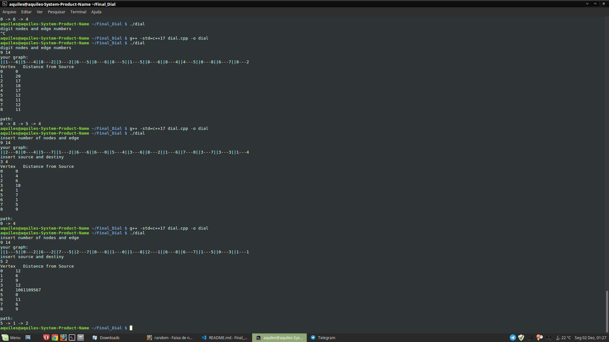

# Dial

## Alunos
|Matrícula | Aluno |
| -- | -- |
| 16/0010331 | José Aquiles Guedes de Rezende |

## Sobre 
Implementação do algoritmo de djkstra com simples buckets(tambem chamado de dial), é uma otmização do algoritmo de djkstra quando o peso das arestas são pequenos

## Screenshots

## Instalação 
**Linguagem**: c++ 

para rodar:

    g++ -std=c++17 dial.cpp -o dial
    ./dial

## Referencia

[https://www.geeksforgeeks.org/dials-algorithm-optimized-dijkstra-for-small-range-weights/]

